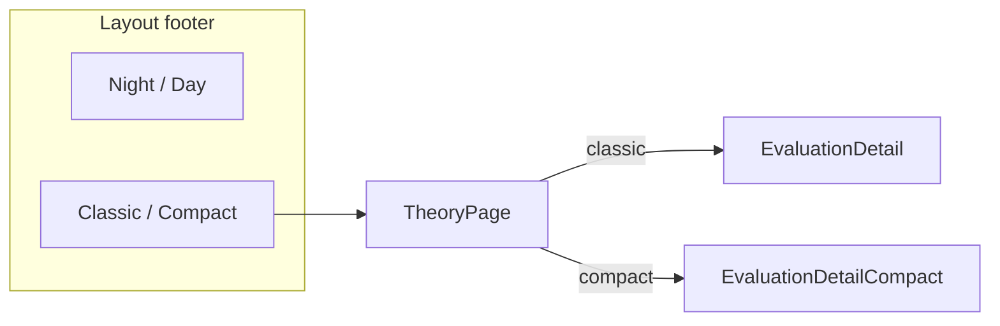

# Compact ATLAS score view

## Scope

- **In scope:** `[TheoryPage.tsx](c:\vagrant\ATLAS\atlas-frontend\src\pages\TheoryPage.tsx)` score presentation + global toggle in footer next to `[ThemeToggle.tsx](c:\vagrant\ATLAS\atlas-frontend\src\components\ThemeToggle.tsx)`.
- **Out of scope:** Explorer landing, About page, markdown export format (unless you want export to follow compact later).
- **Unchanged when Classic is selected:** Existing `[EvaluationDetail.tsx](c:\vagrant\ATLAS\atlas-frontend\src\components\EvaluationDetail.tsx)` + current TheoryPage hero/composite/triptych layout.

Day/night (`ThemeContext`) stays as-is; compact is an orthogonal **layout mode** stored separately so users can mix e.g. Day + Compact.




---

## 1. Layout mode state (persisted)

Add `[src/types/layout.ts](c:\vagrant\ATLAS\atlas-frontend\src\types\layout.ts)`:

```ts
export type ScoreLayoutMode = 'classic' | 'compact';
```

Add `[src/context/ScoreLayoutContext.tsx](c:\vagrant\ATLAS\atlas-frontend\src\context\ScoreLayoutContext.tsx)` mirroring `[ThemeContext.tsx](c:\vagrant\ATLAS\atlas-frontend\src\context\ThemeContext.tsx)`:

- `localStorage` key e.g. `atlas-score-layout`
- Default: `'classic'`
- Wire in `[main.tsx](c:\vagrant\ATLAS\atlas-frontend\src\main.tsx)` around `ThemeProvider`

Add `[ScoreLayoutToggle.tsx](c:\vagrant\ATLAS\atlas-frontend\src\components\ScoreLayoutToggle.tsx)`: pill group styled like `ThemeToggle` with labels **Classic** | **Compact**.

Update `[Layout.tsx](c:\vagrant\ATLAS\atlas-frontend\src\components\Layout.tsx)` footer to a horizontal flex row: `ThemeToggle` + `ScoreLayoutToggle` with gap (centered, wraps on small screens).

---

## 2. Shared data helpers

**Feed access** — reduce triple JSON imports by adding `[src/data/evaluations.ts](c:\vagrant\ATLAS\atlas-frontend\src\data\evaluations.ts)`:

```ts
import feed from '../../atlas-score-examples.json';
export const evaluations = (feed as ExamplesFeed).examples;
```

Refactor `TheoryPage`, `ExplorerPage`, `Header` to import from there (small, keeps random-picker trivial).

**Random theory** — `[src/utils/pickRandomEvaluation.ts](c:\vagrant\ATLAS\atlas-frontend\src\utils\pickRandomEvaluation.ts)`:

- Input: `examples`, `excludeId`
- Filter out current id (slug-normalized via existing `[normalizeSlug](c:\vagrant\ATLAS\atlas-frontend\src\utils\normalizeSlug.ts)`)
- If only one record, return `null` (button disabled with title)
- Else uniform random pick

**Override copy** — `[src/utils/overrideDisplay.ts](c:\vagrant\ATLAS\atlas-frontend\src\utils\overrideDisplay.ts)`:


| Flag                        | Heading           | Explanation (static, from schema / ExplorerGuide)                                              |
| --------------------------- | ----------------- | ---------------------------------------------------------------------------------------------- |
| `closure_override_applied`  | Closure override  | When ETS = 4 (complete mechanistic theory), composite is anchored at 10 regardless of SES/EIS. |
| `negative_override_applied` | Negative override | When ETS = −1 (debunked), only negative SES/EIS values count toward the composite.             |


Return only applied entries. Each row UI:

- **Applied** — bold green (`text-emerald-600` day / `text-emerald-400` night) + check icon (inline SVG)
- Short explanation paragraph below
- Optional secondary line from `evaluation.score_calculation.rule_applied` when it mentions that rule (DNA example already has closure text there)

Hide the entire overrides subsection when the array is empty.

---

## 3. Compact UI component

New `[src/components/EvaluationDetailCompact.tsx](c:\vagrant\ATLAS\atlas-frontend\src\components\EvaluationDetailCompact.tsx)` + optional small presentational helpers in the same file or `[CompactSubsection.tsx](c:\vagrant\ATLAS\atlas-frontend\src\components\CompactSubsection.tsx)`.

### Shell: one main section

Single outer `<article>` (one card: border, `bg-atlas-deep/80`, padding) — **no per-field InfoBlock cards**.

Internal structure uses lightweight subsections only (no nested card borders).

### Sub-heading typography (brand colours)

Reuse existing CSS vars from `[index.css](c:\vagrant\ATLAS\atlas-frontend\src\index.css)` (`--nrp-teal` / `--nrp-sky`):

- `font-display font-black uppercase tracking-widest`
- Alternate or stagger: `text-[#086783]` (teal) and `text-[#039ad2]` (sky) — e.g. odd sections teal, even sky, or map by section type
- Body stays `font-body text-sm text-atlas-muted`

### Default visible block (always shown)

Matches your list — rendered inside the main article:

1. **Framework title row** — `framework_name` + compact composite pill (reuse `[getCompositeAccentColor](c:\vagrant\ATLAS\atlas-frontend\src\utils\scoreColor.ts)` from TheoryPage)
2. **Composite score** — smaller than classic hero (e.g. `text-4xl` mono) but still prominent
3. **Base scores** — reuse `[ScoreTriptych](c:\vagrant\ATLAS\atlas-frontend\src\components\ScoreTriptych.tsx)` with tighter spacing wrapper (`gap-2`, reduced outer margin) rather than duplicating triptych logic
4. **Specific claim evaluated**
5. **Framework description**

Remove duplicate `specific_claim` from TheoryPage header when compact is active (keep `framework_status · claim_type` + title only).

### Expandable “full view”

- Local state `expanded` default `false` (optional: persist `atlas-score-compact-expanded` in sessionStorage if you want it to stick during browsing)
- Update the URL with a ? query param indicating it's expanded, so people copy/paste the URL can share the full view state. 
- Also add a small link button next to the # ID of the header of each section that copies the URL including that header ID (need to make sure they have a header ID, so upon opening it'll show at that section.
- Control: full-width button at bottom of default block — **Show Full Evaluation** / **Show Compact** (`aria-expanded`)
- Expanded content includes everything currently in `EvaluationDetail` that is not in the default five, reorganized:


| Section                             | Layout                                                                                                                                       |
| ----------------------------------- | -------------------------------------------------------------------------------------------------------------------------------------------- |
| Highlights                          | Full width; chip wrap (reuse `buildEvaluationHighlightTags` + `getHighlightTagStyle`)                                                        |
| Domains of inquiry                  | `grid grid-cols-1 sm:grid-cols-2 lg:grid-cols-3`                                                                                             |
| Ontological scales                  | Same 2–3 column grid                                                                                                                         |
| Framework classification            | Same grid (`framework_status`, `claim_type` as cells)                                                                                        |
| Context of validity, Interpretation | Full-width prose                                                                                                                             |
| Score calculation                   | Keep calculation/scales toggle from classic (can lift toggle + both views into a shared subcomponent later; v1 may duplicate minimal markup) |
| ETS/SES/EIS justifications          | `grid sm:grid-cols-2 lg:grid-cols-3`                                                                                                         |
| Applied overrides only              | Full width; conditional                                                                                                                      |
| Triggered notes                     | Full width; same `ANALYSIS_LABELS` map as today                                                                                              |


### Compact-specific copy tweaks

- Drop the long Highlights intro paragraph (compact = scannable)
- Overrides: never show “not applied” lines

---

## 4. TheoryPage integration

`[TheoryPage.tsx](c:\vagrant\ATLAS\atlas-frontend\src\pages\TheoryPage.tsx)`:

```tsx
const { layout } = useScoreLayout();

// classic: existing sections unchanged
// compact:
//   - slim header (no claim paragraph)
//   - single <EvaluationDetailCompact evaluation={evaluation} />
//   - no separate composite hero / base scores sections outside compact article
```

**Random Next Theory** button in the footer action row (with Copy as Markdown / Back to Explorer):

- Label: `Random next theory`
- `onClick` → `navigate(\`/${pickRandomEvaluation(examples, evaluation.id).id})`
- Disabled when `examples.length <= 1`
- `aria-label` describes random navigation

---

## 5. Styling notes

- Compact mode does **not** need new `data-theme` values; it uses existing night/day tokens for surfaces and explicit `#086783` / `#039ad2` for subsection titles.
- Slightly wider max width on compact theory page optional (`max-w-6xl`) to use 3-column grids on large screens.
- Ensure focus rings and contrast on day theme for teal/sky headings (WCAG: headings are decorative emphasis; body text remains on `atlas-muted` / `atlas-bright-text`).

---

## 6. Changelog

Per workspace rule, add under `# WIP` in `[CHANGELOG.md](c:\vagrant\ATLAS\atlas-frontend\CHANGELOG.md)`:

`* 2026-05-18th - Added Classic/Compact score layout toggle, compact single-panel theory view with expandable sections, conditional overrides, and random next theory`

---

## 7. Testing checklist (manual)

- Toggle Classic ↔ Compact on theory page; refresh — preference persists
- Compact default shows only composite, base scores, claim, description; expand reveals rest
- DNA (`closure_override_applied: true`) shows green Applied + closure explanation; Evolution shows no override block
- Debunked example (`negative_override_applied: true`) shows only negative override
- Highlights / domains / ontological / classification render 2–3 columns at `lg`
- Random next navigates to a different theory; never loops to same id
- Night and Day both readable with teal/sky sub-headings
- Classic path unchanged (regression on existing EvaluationDetail)

---

## File touch summary


| File                                         | Action                        |
| -------------------------------------------- | ----------------------------- |
| `src/types/layout.ts`                        | New                           |
| `src/context/ScoreLayoutContext.tsx`         | New                           |
| `src/components/ScoreLayoutToggle.tsx`       | New                           |
| `src/components/EvaluationDetailCompact.tsx` | New                           |
| `src/data/evaluations.ts`                    | New                           |
| `src/utils/pickRandomEvaluation.ts`          | New                           |
| `src/utils/overrideDisplay.ts`               | New                           |
| `src/components/Layout.tsx`                  | Footer toggle group           |
| `src/main.tsx`                               | Provider                      |
| `src/pages/TheoryPage.tsx`                   | Branch layout + random button |
| `CHANGELOG.md`                               | WIP entry                     |


Optional follow-up (not in v1): extract shared “score calculation” block from `EvaluationDetail` to avoid duplication; add compact layout to ExplorerGuide.